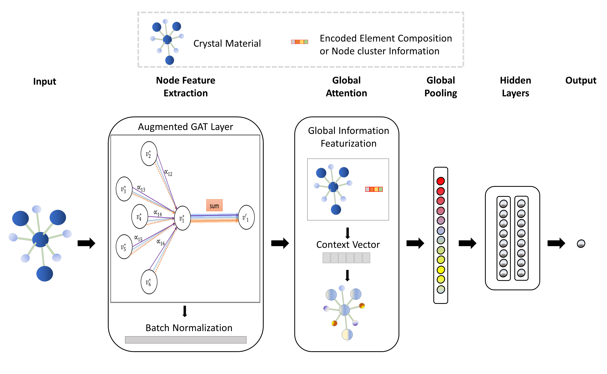

# GATGNN
Official Pytorch repository for our paper "GLOBAL ATTENTION BASED GRAPH CONVOLUTIONAL NEURAL NETWORKS FOR IMPROVED MATERIALS PROPERTY PREDICTION" [GATGNN](https://arxiv.org/pdf/2003.13379.pdf). 
by [Steph-Yves Louis](http://mleg.cse.sc.edu/people.html), et. al. ... 

